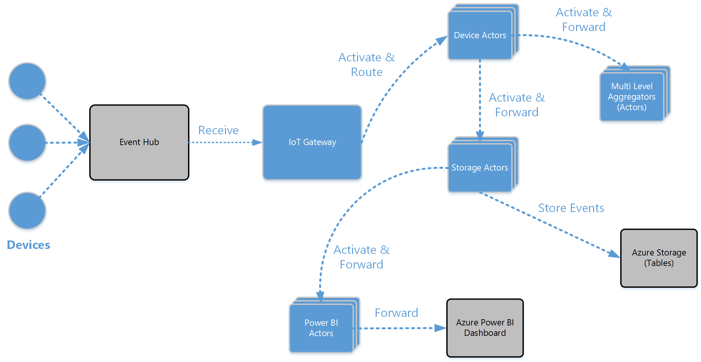

# Service Fabric IoT Sample
This sample is a reference architecture & implementation for hyper scale IoT event processing. The sample uses compute and storage with Azure Service Fabric and integrates with Azure Storage, Azure Power BI, and Event Hubs. 

## Sample Solution Overview

This above diagram depicts the solution components, below is brief description of each component:
	
1. Devices are sensors, sensor gateways or IoT devices that are publishing events to Event Hub either directly or using Microsoft IoT Hub SDK.
2. Gateway is a logical component that groups processing, management of event processors. Event processor routes and activates device actors. 
3. Device Actor are chained with various other actor types that are responsible for aggregating, storing, analysis and reporting on device events. 

> for more details on the architecture refer to [Architecture & Usage Details](./docs/Architecture.md)

## Components & Code Overview
The project is composed of the following components, the code for which is included in one Visual Studio solution: 

- **IoTApplication** A Service Fabric application that hosts the following actors. Each actor is a separate Service and a separate Visual Studio project.
	1. **Device Actor** represents a device in the cloud. Designed to perform compute and analysis on single device events and communicate commands to the device. Additional it forwards device events to 
		1. *Aggregators* such as floors (in smart building scenarors) or production line (in factory floor scenarios).
		2. *Storage Actor*  
	2. **Floor Actor** represents the first-level logical aggregators. Designed to perform compute and analysis on multiple devices grouped logically. It can also communicate commands to all aggregated devices.
	3. **Building Actor** represents the second-level logical aggregators similar to *Floor Actor* but aggregates at the building levels.
	4. **Storage Actor** is responsible for storing device events in Azure storage (tables). It is also responsible forwarding the events to PowerBI actor.
	5. **PowerBI Actor** is responsible for forwarding the device events to Microsoft Azure Power BI dashboard.
	6. *Actor Interface* all the above actors implement the same actor interface which is separated in a class library (IoTActor.Common).

> In your implementation you can add and chain as many aggregators as needed.

- **Gateway** is a logical component that groups the following components
	- **Event Processor** is a Service Fabric application that contains one service. This service is responsible for
		1. Receiving device events from one or more Azure Event Hubs.
		2. Activing device actors. Each device is represented by one actor instance.
		3. Routing events to the correct device actor.
	- **Processor Management** is a Service Fabric application that contains one service. This service is responsible for
		1. Provisioning and de-provisioning *Event Processors*.
		2. Routing event processor management commands (pause, resume, drain, stop, status) to the correct event processor.
	- **Common Components** 
		1. *PowerShell Management Assembly & PS Module* The processor management component exposes a REST api which you can build a UX on top of. Alternativly you can use PowerShell to interact with processor management service
		2. *Gateway Client's Assembly* Models (POCO) used by the *Event Processor* & *Processor Management*, can also be used by UX clients.
		3. *Gateway Common Components* contains various components used by the Gateway services. 

## Next Steps
1. [Getting Started](./docs/GettingStarted.md)
2. [Architecture & Usage Details](./docs/Architecture.md)
3. [Configuring, Deploying & Debugging the Solution](./docs/ConfigureDeploy.md)
