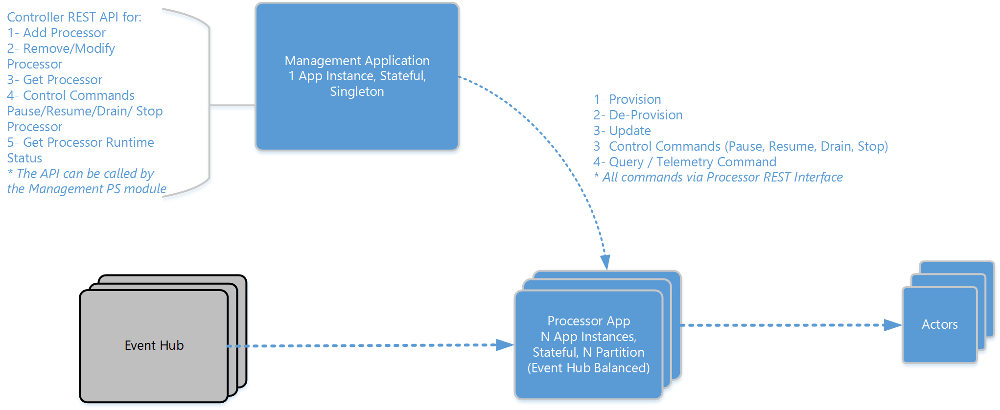

#Architecture & Usage Details#

This IoT sample reference architecture & implementation is designed for a Smart Building scenario where a building has a device sensor in each room and data is sent to the cloud for monitoring and analysis. Specifically the device sends information regarding whether the lights are on or off, current temperature, current humidity, etc.  

> In the code project the expected event schema is available in 
> 
> 1. */src/actors/PowerBIActor/PackageRoot/Data/Datasetschema.json* Used to provision the PowerBI Dataset
> 2. */src/Gateway/IoTProcessorManagement/internalfunctions.cs* Contains a static method used by a cmdlet in the *PS management module* that sends test events to the solution.

> By replacing the event data schema and actor names the components can fit in various other IoT scenarios where analysis, monitor, storing and aggregation are needed. 

#Typical Use Cases:

> **Notes**
>
> - To import the management PowerShell module use 
>
>    Import-Module .\IoT-Functions.psm1 (part of IotProcessorManagement project output, check PowerShell folder)
>
> - All the cmdlets expects an optional management endpoint address. The management endpoint address can be aquired by calling *Get-IoTManagementApiEndPoint* cmdlet. If no address provided each cmdlet will resolve the address using the constants declared at top of the module.

##Provisioning
Provision a new event processor service via calling the management service REST API or via using the management PowerShell module. Both expects a processor definition which contains:
1. Name
2. Number - *at least one* - of Event Hub definition each contains:
	1. Azure Service Bus connection string.
	2. Event Hub Name.
	3. Event Hub consumer group name (empty for default group).

The management component provision a new Service Fabric application of type *IoTEventHubProcessorApp*. Once created it uses the processor definition to distribute the event hub receive load among *IoTEventHubEventProcessorService* partitions. 

> To provision a new processor you can call *Add-IoTProcessor* cmdlet which >expects Processor object. Or 
> 
> 1. Build the solution.
> 2. In PS console change directory to *src/Gateway/IoTProcessorManagement/bin/Debug/PowerShell* in PowerShell.
> 3. Modify processor.json file.
> 4. Use *Import-IoTProcessor -FilePath .\Processor.json* PS cmdlet.

You can update the number of partitions created for each new processor by modifying applicationmanifest.xml in */src/Gateway/ProcessorApp* *ServiceTemplates* node. 

##Interacting with Event Hub Processor 
Once a processor is provisioned you can interact with it using the following commands (commands are sent to the management component which routes it to the correct processor):

>All the control cmdlet expects either *Processor Name* or *Processor Object*. 

> You can get a reference to a specific processor object by calling Get-IoTProcessor {ProcessorName}. If ProcessorName is not provided the cmdlet will return all processor as an array.

- **Pause** - Pauses the processor (pauses receive and pauses route to actor processes).

> To pause a processor call Suspend-IoTProcessor {ProcessorName}

- **Resume** -Resumes a previously paused processor. 

> To resumes a processor call Resume-IoTProcessor {ProcessorName}

- **Drain** - stops the processor from receiving new events, yet the processor will route any previously buffered events to actors. once a processor is drained it will enter *stopped* state.

> To drain a processor call Stop-IoTProcessor {ProcessorName} -Drain

- **Stop** - Stops the processor from receiving new events, and stops any buffered events from being routed. 

> To stop a processor call Stop-IoTProcessor {ProcessorName} 

##Telemetry
The solution provides the following types of telemetry

1. Near real time device events telemetry which can be viewed on PowerBI Dashboard. 
2. Infrastructure health telemetry via [Service Fabric Health](https://azure.microsoft.com/en-us/documentation/articles/service-fabric-health-introduction/) API.
3. Real Time Processor telemetry (processor performance counters such as averages and number of events posted and processed over a min, an hour). The management component aggregate telemetry from event processor partitions. To get processor telemetry use

> Get-IoTProcessorRuntimeStatus {processorName} 

The above command will list telemetry results per partition if you want a "rollup" view use

> Get-IoTProcessorRuntimeStatus {processorName} -Rollup

##Updating a Processor
A processor can be updated *while it is running* using Update-IoTProcessor cmdlet which expects a processor object. Or use the same Import-IoTProcessor cmdlet as the following

> Import-IoTProcessor -FilePath .\Processor.json -Update

> Note: *The processor Event Hub listeners will be immediately recreated to match the new definition but previously buffered events (from old event hub definitions) will still be routed as normal* 

##Removing a Processor
To remove a processor use the following cmdlet

> Remove-IoTProcessor {processorname}

##Sending Test Events
To send test events use *Send-TestEvent* cmdlet to send test events. This cmdlet expects Processor object and optionally number of events and number of publishers.  

##Actors
In this scenario actors are designed to perform minimal function and chain the call to other actors for further processing. This further processing can be:
1. Processing at aggregation level such as the case of device->floor->building
2. Specialized processing such as storage or PowerBI. 

###Actor Implementation 
Actors that perform specialized processing uses a *store and periodical process* pattern as the following: 
1. Receive event data, queue it and return to caller immediately.
2. On periodical bases (using Actor [Reminder Timers](https://azure.microsoft.com/en-us/documentation/articles/service-fabric-reliable-actors-timers-reminders/)) the queued events are processed (i.e stored in Azure Storage or forwarded to PowerBI REST API). 

Other Actors in this samples just act as a placeholder for further processing logic (such as sending commands to the *Device*, *Devices in a Floor* or *Devices in All Floors* in a Building) 

##Inside a Processor

The following is the basic process performed inside a Processor:

1. Each Processor exposes one REST endpoint to receive commands and query from the management component.
2. Each Processor uses *one* or many Event Hub listeners (based on the processor definition). 
3. Event Hub Listeners receive events and place them in Reliable Queues (*one per Device*). 
4. A de-queue process is responsible for moving the events from the Reliable Queues to the Device Actors. 

This architecture depicts a basic end to end story for devices to cloud.  This architecture can easily be modified to include more complicated scenarios including a web management portal, commands to the devices or mobile app that shows current data.

## Guided Walkthrough
Follow the below steps for guided walkthrough using the sample

- Check [Configuration, Deployment & Debugging's](./ConfigureDeploy.md) configuration & deployment sections to deploy the solution on your development environment. 
- Open a new PS console. Change directory to *src/Gateway/IoTProcessorManagement/bin/Debug/PowerShell*. The content of directory is created as part of the build process. 
- Replace the content of processor.json (after updating it with the correct information) with 

> {
>  "Name": "P1", 
>  "Hubs": [
>    {
>        "ConnectionString" :"Endpoint=sb://[namespace].servicebus.windows.net;SharedAccessKeyName=[Key Name];SharedAccessKey=[SAS key];TransportType=Amqp",
>        "EventHubName" : "[Event Hub Name]",
>       "ConsumerGroupName" : "[Consumer group name or empty string for default group]"
>    }]}

- Import the solution PS management function using 

> Import-Module .\IoT-Functions.psm1

- Validate that the management component is working correctly by (the following command should result into no errors and empty results since no processors has been activated yet).  

> Get-IoTProcessor

- Provision a new processor using. the result will be Processor object with the name *P1* and Status *New*  

> Import-IoTProcessor -FilePath .\Processor.json

- Wait few seconds until provisioning is completed (while Service Fabric activates the new application). And execute the below command (the result is one processor with the status *Provisioned*)

> Get-IoTProcessor  

- Send test events to the event hub using the below script (the below sends 100 events, 10 per device).  

> $P = Get-IoTProcessor P1
> Send-TestEvents -IoTProcessor $P -NumberOfMessages 10 -NumberOfPublishers

- Navigate to your PowerBI dashboard, you should be able to see events coming to your *ServiceFabricIoTDS* dataset. Use Vs.NET clould explorer to view the data in your storage account. 

- Send more test events

- Display the processor runtime telemetry using

> Get-IoTProcessorRuntimeStatus -IoTProcessor P1

- **Tip:** the above command's result gives you an indication on how fast your processor is performing against the expected load. You can optimize by modifying the number of processor partitions, and values used to initialize WorkManager object instance in processor *RunAsync* method 

- Pause the processor using 

> Suspend-IoTProcessor P1 
> Get-IoTProcessor P1  

- The above will yield results of processor object with *pending pause* status. execute *Get-IoTProcessor P1* again you will see the processor status changed to *paused*

- Recheck the processor runtime telemetry to validate that the processor is paused.

- Resume the processor by executing 

> Resume-IoTProcessor P1 
> Get-IoTProcessor P1

- Recheck the processor runtime telemetry to validate that the processor is resumed.

- Remove the processor by executing 

> Remove-IoTProcessor P1

